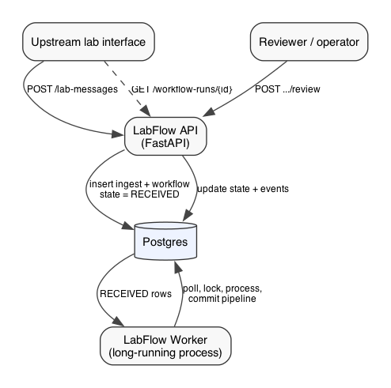
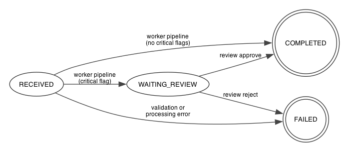
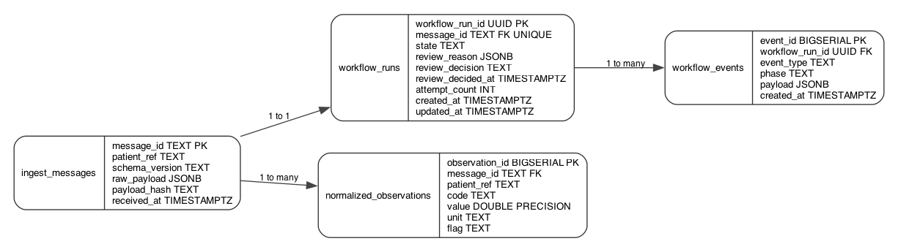

# LabFlow Design Document

**Status:** draft v0  
**Last updated:** 2026-06-24

## Summary

LabFlow ingests lab-result messages from upstream systems, runs each through a durable processing pipeline, and exposes status and outcomes over HTTP. Version `v0` covers one JSON message shape, one workflow per message, Postgres-backed state, a separate worker process, and manual review for critical results.

## Problem

Platforms that receive external lab results need to accept retried deliveries without duplicate processing, survive process restarts, record what happened, and hold critical results for human review before marking them complete.

LabFlow handles one case: a JSON payload with numeric observations (potassium, sodium, glucose). The API accepts and persists the message; a worker normalizes observations, evaluates threshold rules, and either completes or opens a review gate.

## Goals

- Accept lab messages with sender-assigned idempotency keys.
- Process each message asynchronously with durable state and an event log.
- Normalize observations into a queryable internal format.
- Flag critical values and route them to manual review.
- Expose status and history via HTTP.
- Run locally on Python, FastAPI, Postgres, and Docker Compose.

## Non-Goals

- Real PHI in fixtures or logs.
- FHIR, HL7, or full clinical decision support.
- Multi-region HA or a large worker fleet in the first release.
- A UI beyond HTTP APIs.

## Future Goals

- Replace the custom state machine with a workflow engine (Temporal, AWS Step Functions, or similar) once human-in-the-loop steps, timers, or long-running waits outgrow hand-rolled Postgres polling.
- Add a message broker or transactional outbox so workers consume from a queue instead of polling `workflow_runs`.
- Support multiple inbound triggers (file drop, webhook, HL7 feed) without changing the core processing pipeline.
- Correlate related messages via `report_id` (preliminary, final, corrected results).
- Move rules into configuration or a managed rules store.
- Add optional model-assisted review summaries before human sign-off.
- Production deployment with auth, metrics, and operational dashboards.

## System Overview



### Components

| Component | Role | Process |
|---|---|---|
| Upstream interface | Sends lab-result JSON | External |
| LabFlow API | Ingest, validate, expose status and review | FastAPI web server |
| Postgres | Messages, workflow state, events, results | Database |
| LabFlow Worker | Runs the automated pipeline on pending workflows | Long-running background process |
| Reviewer | Approves or rejects flagged runs | Human or client system via API |

### Request lifecycle

| Step | Actor | Action |
|---:|---|---|
| 1 | Upstream | `POST /lab-messages` with lab-result payload |
| 2 | API | Validate payload; persist message and workflow row (`state = RECEIVED`); return `workflow_run_id` |
| 3 | Worker | Poll Postgres; claim one `RECEIVED` row; run pipeline; commit |
| 4 | Upstream | Poll `GET /workflow-runs/{id}` until terminal or `WAITING_REVIEW` |
| 5 | Reviewer | If waiting, `POST /workflow-runs/{id}/review` with approve or reject |
| 6 | Upstream | Fetch final status and normalized observations |

The API never executes pipeline logic during ingest. The worker never serves HTTP.

## Definitions

| Term | Meaning |
|---|---|
| **Lab message** | One inbound transmission. The sender assigns `message_id` before POST. Retries reuse the same ID and body. |
| **Workflow run** | LabFlow's processing record for one lab message. LabFlow assigns `workflow_run_id`. |
| **Observation** | One analyte in a message (for example potassium 4.2 mmol/L). |
| **Normalized observation** | One row in `normalized_observations`. See [Storage](#storage). |
| **Pipeline** | Validate stored payload, write normalized rows, evaluate rules. See [Worker](#worker). |

### Identifiers

| Field | Source | Role |
|---|---|---|
| `message_id` | Upstream | Idempotency key for this transmission. |
| `workflow_run_id` | LabFlow | Client-facing processing ID. |
| `patient_ref` | Upstream | Opaque patient correlation ID. |
| `report_id` | Upstream (future) | Groups related messages for the same lab report. |

### Ingestion idempotency

Duplicate `POST /lab-messages` with the same `message_id` and the same body returns the existing workflow (`200 OK`).

Same `message_id` with a different body returns `409 Conflict`. The sender must issue a new `message_id` for changed content.

**Body comparison:** compute SHA-256 over a canonical JSON form of the request body (stable key order, no insignificant whitespace) and store it as `payload_hash` on `ingest_messages`. On a duplicate `message_id`, compare the incoming hash to the stored hash. This matches common idempotency-key behavior (Stripe, PayPal, and similar APIs): the key identifies the operation; the payload must match for a safe retry.

## Workflow

### State machine

`workflow_runs.state` holds the workflow state.



| State | Meaning |
|---|---|
| `RECEIVED` | Message persisted; worker has not finished automated processing. |
| `WAITING_REVIEW` | Pipeline finished; at least one critical observation needs a human decision. |
| `COMPLETED` | Success terminal state. |
| `FAILED` | Failure terminal state (processing error or rejected review). |

Phase-level detail is recorded in `workflow_events`. The state column moves at workflow boundaries only.

### Pipeline

The worker runs three phases for each claimed `RECEIVED` run:

1. **Validate** — verify `ingest_messages.raw_payload` against the lab-message contract.
2. **Normalize** — upsert rows into `normalized_observations`.
3. **Evaluate rules** — set `flag` on each row; set terminal state to `COMPLETED` or `WAITING_REVIEW`.

The API validates on ingest (`400` on failure). The worker re-validates from storage before writing derived data.

### Event log

Each state transition writes rows to `workflow_events`. Column definitions are in [`workflow_events`](#workflow_events).

**Ingest** (`POST /lab-messages`):

| event_type | phase | When |
|---|---|---|
| `workflow.created` | `validate` | New workflow row inserted. |

**Successful automated pipeline** (single transaction):

| event_type | phase | When |
|---|---|---|
| `phase.completed` | `validate` | Stored payload passed validation. |
| `phase.completed` | `normalize` | Observation rows upserted. |
| `phase.completed` | `evaluate_rules` | Rules applied. |
| `workflow.completed` | `evaluate_rules` | No critical flags; `state` set to `COMPLETED`. |
| `workflow.waiting_review` | `evaluate_rules` | Critical flags; `state` set to `WAITING_REVIEW`. |

Write either `workflow.completed` or `workflow.waiting_review`, not both. Both paths include the three `phase.completed` rows.

**Failed pipeline** (separate transaction after rollback):

| event_type | phase | When |
|---|---|---|
| `phase.failed` | current phase | Processing error. |
| `workflow.failed` | current phase | `state` set to `FAILED`. |

**Review** (`POST /workflow-runs/{id}/review`):

| event_type | phase | When |
|---|---|---|
| `review.decided` | `review` | Decision recorded. |
| `workflow.completed` or `workflow.failed` | `review` | Terminal state set. |

### Durability

The automated pipeline commits in one transaction: row lock, observation upserts, rule updates, event inserts, and state change. A crash before commit rolls everything back; the run stays `RECEIVED` and the worker retries.

If phases were split across separate transactions, partial progress would survive crashes and recovery logic would need to track which phase to resume. Version `v0` keeps the pipeline in one commit because all phases are fast and in-memory. Long-running or external steps would justify splitting later.

Failure handling uses a second transaction: after rollback, write `phase.failed` and `workflow.failed`, then set `state = FAILED`.

### Review gate

Review applies to the workflow run (one lab message), not to individual observation rows. One decision covers all observations.

When multiple rules match, `review_reason` is a JSON array of matched rule descriptions (for example `["potassium >= 6.0 mmol/L"]`). Version `v0` has one rule, so the array usually has one element.

## Storage



Postgres is the durability boundary. JSON contract schemas live in `schemas/`. See [contributing.md](contributing.md) for updating diagrams.

### `ingest_messages`

| Column | Type | Notes |
|---|---|---|
| `message_id` | `TEXT PK` | Upstream idempotency key. |
| `patient_ref` | `TEXT NOT NULL` | Copied from payload for lookup without parsing JSONB. |
| `schema_version` | `TEXT NOT NULL` | |
| `raw_payload` | `JSONB NOT NULL` | Body as received. |
| `payload_hash` | `TEXT NOT NULL` | SHA-256 of canonical request body. |
| `received_at` | `TIMESTAMPTZ NOT NULL DEFAULT now()` | |

### `workflow_runs`

| Column | Type | Notes |
|---|---|---|
| `workflow_run_id` | `UUID PK DEFAULT gen_random_uuid()` | Returned to clients. |
| `message_id` | `TEXT NOT NULL UNIQUE REFERENCES ingest_messages` | One run per message in version `v0`. |
| `state` | `TEXT NOT NULL` | See [State machine](#state-machine). |
| `review_reason` | `JSONB` | Matched rule descriptions when entering `WAITING_REVIEW`. |
| `review_decision` | `TEXT` | `approve` or `reject`. |
| `review_decided_at` | `TIMESTAMPTZ` | |
| `attempt_count` | `INTEGER NOT NULL DEFAULT 0` | Reserved for retry logic. |
| `created_at` | `TIMESTAMPTZ NOT NULL DEFAULT now()` | |
| `updated_at` | `TIMESTAMPTZ NOT NULL DEFAULT now()` | |

Review fields live on the workflow row. A separate review table is unnecessary until assignment queues or SLAs are required.

### `workflow_events`

Append-only audit log. Written in the same transaction as the state change it describes.

| Column | Type | Notes |
|---|---|---|
| `event_id` | `BIGSERIAL PK` | |
| `workflow_run_id` | `UUID NOT NULL REFERENCES workflow_runs` | |
| `event_type` | `TEXT NOT NULL` | |
| `phase` | `TEXT NOT NULL` | `validate`, `normalize`, `evaluate_rules`, `review`. |
| `payload` | `JSONB NOT NULL DEFAULT '{}'` | Phase-specific detail (counts, errors, rule hits). |
| `created_at` | `TIMESTAMPTZ NOT NULL DEFAULT now()` | |

Which events are written at each transition is specified in [Event log](#event-log).

### `normalized_observations`

One row per observation. The normalize phase flattens the nested `observations` array from `raw_payload` and adds `flag` after rule evaluation.

| Column | Type | Notes |
|---|---|---|
| `observation_id` | `BIGSERIAL PK` | |
| `message_id` | `TEXT NOT NULL REFERENCES ingest_messages` | |
| `patient_ref` | `TEXT NOT NULL` | Copied from the message so observation queries avoid joining `ingest_messages`. |
| `code` | `TEXT NOT NULL` | |
| `value` | `DOUBLE PRECISION NOT NULL` | |
| `unit` | `TEXT NOT NULL` | |
| `flag` | `TEXT NOT NULL DEFAULT 'normal'` | `normal` or `critical`. |

Unique on `(message_id, code)`.

## API

Base path: `/api/v0`. Fixtures: `examples/`.

### `GET /health`

**Response `200`:**

```json
{"status": "ok"}
```

### `POST /lab-messages`

Accepts one lab-result message. Schema: `schemas/lab-message-v0.schema.json`. Response schema: `schemas/lab-message-ingest-response-v0.schema.json`.

**Request body:**

```json
{
  "schema_version": "lab-message-v0",
  "message_id": "MSG-0001",
  "patient_ref": "pt-8842",
  "observations": [
    {"code": "potassium", "value": 4.2, "unit": "mmol/L"},
    {"code": "sodium", "value": 139, "unit": "mmol/L"}
  ]
}
```

| Field | Required | Description |
|---|---:|---|
| `schema_version` | yes | Must be `lab-message-v0`. |
| `message_id` | yes | Sender-assigned transmission ID. |
| `patient_ref` | yes | Opaque patient ID from upstream. |
| `observations` | yes | Non-empty list of results. |
| `observations[].code` | yes | `potassium`, `sodium`, or `glucose`. |
| `observations[].value` | yes | Numeric result. |
| `observations[].unit` | yes | Unit as sent by upstream. |

**Response:**

```json
{
  "workflow_run_id": "wr_01HXYZ",
  "message_id": "MSG-0001",
  "state": "RECEIVED"
}
```

| Code | Condition |
|---|---|
| `202` | New message accepted. |
| `200` | Existing `message_id` with matching `payload_hash`. |
| `400` | Invalid payload. |
| `409` | Same `message_id`, different body. |

Persists to `ingest_messages` and `workflow_runs`; writes `workflow.created`. Processing continues in the [Worker](#worker).

### `GET /workflow-runs/{workflow_run_id}`

Response schema: `schemas/workflow-run-response-v0.schema.json`.

**Response `200`:**

```json
{
  "workflow_run_id": "wr_01HXYZ",
  "state": "COMPLETED",
  "source_message_id": "MSG-0001",
  "patient_ref": "pt-8842",
  "normalized_observations": [
    {"code": "potassium", "value": 4.2, "unit": "mmol/L", "flag": "normal"}
  ],
  "review_required": false
}
```

When `state` is `WAITING_REVIEW`, includes `review_reason` (JSON array) and `review_required: true`.

| Code | Condition |
|---|---|
| `200` | Found. |
| `404` | Unknown `workflow_run_id`. |

### `GET /workflow-runs/{workflow_run_id}/events`

**Response `200`:**

```json
{
  "workflow_run_id": "wr_01HXYZ",
  "events": [
    {
      "event_id": 1,
      "event_type": "workflow.created",
      "phase": "validate",
      "payload": {},
      "created_at": "2026-06-24T12:00:00Z"
    }
  ]
}
```

Paginated. Event shape matches `workflow_events`. See [Event log](#event-log).

| Code | Condition |
|---|---|
| `200` | Found. |
| `404` | Unknown `workflow_run_id`. |

### `POST /workflow-runs/{workflow_run_id}/review`

**Request body:**

```json
{"decision": "approve"}
```

Allowed values: `approve`, `reject`.

**Response `200`:** same shape as `GET /workflow-runs/{id}` with updated state.

| Code | Condition |
|---|---|
| `200` | Decision applied. |
| `404` | Unknown `workflow_run_id`. |
| `409` | Run not in `WAITING_REVIEW`. |

Writes review columns on `workflow_runs` and events per [Event log](#event-log).

## Worker

Standalone process started alongside the API in Docker Compose:

```bash
python -m labflow.worker run
```

`run` loops: claim a `RECEIVED` run, execute the [Pipeline](#pipeline), commit, sleep if idle, repeat. A `--once` flag processes at most one run and exits (for tests).

Pending work is any row with `state = 'RECEIVED'`. Claim query:

```sql
SELECT workflow_run_id
FROM workflow_runs
WHERE state = 'RECEIVED'
ORDER BY created_at
LIMIT 1
FOR UPDATE SKIP LOCKED;
```

The row lock is held until the processing transaction commits. Additional worker replicas skip locked rows via `SKIP LOCKED`.

## Rules

Version `v0` rule (hard-coded):

```text
potassium >= 6.0 mmol/L → flag = critical
```

Any critical observation sends the run to `WAITING_REVIEW`. Matched rule descriptions are stored in `review_reason` as a JSON array.

## Architecture Decisions

**Custom runner first.** The pipeline is short and synchronous inside the worker. A dedicated orchestrator adds operational cost before the domain model is stable.

**Postgres as queue and state store.** Version `v0` uses `workflow_runs.state = RECEIVED` as the work queue. Workers poll and lock rows. A broker can sit between API and worker later.

**State row plus event log.** `workflow_runs.state` answers status queries directly. `workflow_events` records how processing unfolded. Both update in the same transaction on each transition.

**Single worker entrypoint.** `run` matches Docker Compose deployment. Test-only flags handle pre-compose development.

## Reliability

**Ingestion idempotency** — keyed on upstream `message_id` and `payload_hash`. See [Ingestion idempotency](#ingestion-idempotency).

**Worker idempotency** — failed pipeline transactions leave the run in `RECEIVED`. Normalize via upsert on `(message_id, code)`; rules recompute flags from stored values. See [Durability](#durability).

**Retries** — version `v0` fails the run on first processing error. A later version retries transient failures using `attempt_count`.

**Failure** — processing errors and rejected reviews set `state = FAILED`.

## Observability

Structured logs include `workflow_run_id` and `message_id`. Status via `GET /workflow-runs/{id}`; audit via `GET /workflow-runs/{id}/events`. Run-count metrics in a later version.

## Security

Fictional patient IDs in dev fixtures. Secrets via environment variables. Authentication deferred until deployment is defined.

## Version Roadmap

| Version | Scope |
|---|---|
| `v0` | API ingest, worker pipeline, review gate, Postgres polling, Docker Compose. |
| `v1` | Retries, metrics, paginated events. |
| `v2` | `report_id`, alternate triggers. |
| `v3` | Message broker. |
| `v4` | Configurable rules. |
| `v5` | Workflow engine evaluation. |

## Open Questions

| Question | Notes |
|---|---|
| `report_id` in `v2`? | Likely yes. Workflows stay 1:1 with messages. |
| Rules in configuration? | When the rule set grows beyond a handful. |
| Review task table? | Revisit for assignment queues or SLAs. |
| Auth model? | mTLS or OAuth once deployment target is set. |
